

  

 

  

  

  

  

    <i>languages i work with</i>  
    
    
    
    
    
    
    
    
  

  

    <i>tools i use</i>  
    
  

 

## Class of Machine Learning

  <a href="https://github.com/cu-sanjay/Amazon-ML-Summer-School-2026">
    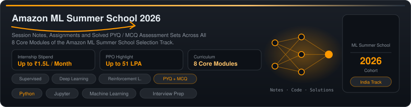
  </a>

## Featured Projects

  <a href="https://readmeme.eu.cc/">
    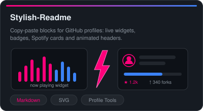
  </a>
  &nbsp;
  <a href="https://github.com/cu-sanjay/Opal">
    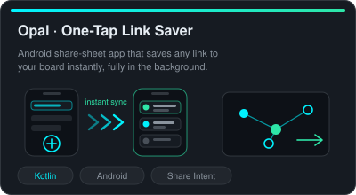
  </a>

  <a href="https://github.com/cu-sanjay/WhatsApp-Chat-Viewer">
    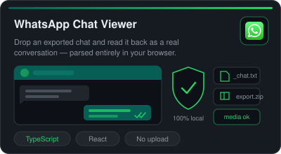
  </a>
  &nbsp;
  <a href="https://github.com/cu-sanjay/Unwatermark">
    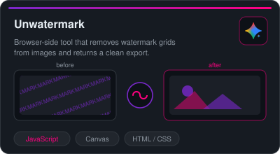
  </a>

  <a href="https://github.com/cu-sanjay/IMDbPlay">
    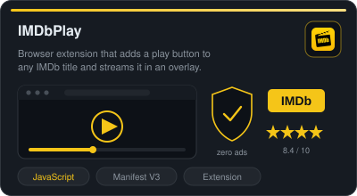
  </a>
  &nbsp;
  <a href="https://github.com/cu-sanjay/Cryptonite-Application">
    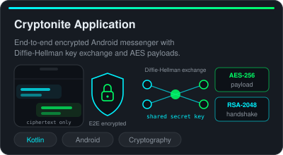
  </a>

  <a href="https://github.com/cu-sanjay/PDF-GPT">
    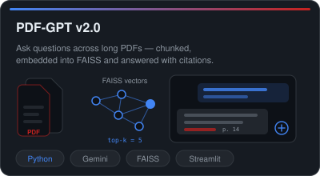
  </a>
  &nbsp;
  <a href="https://github.com/cu-sanjay/RTFRS">
    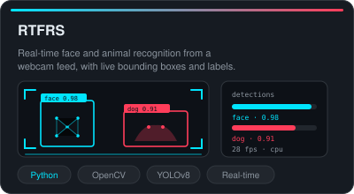
  </a>

  <a href="https://github.com/cu-sanjay/web-favicon-rotator">
    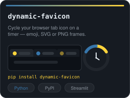
  </a>
  &nbsp;
  <a href="https://github.com/cu-sanjay/ARTXT.SYS">
    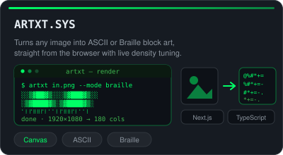
  </a>
  &nbsp;
  <a href="https://github.com/cu-sanjay/IPL-2026-API-Free">
    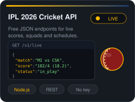
  </a>

  <a href="https://github.com/cu-sanjay/Competitive-Programming">
    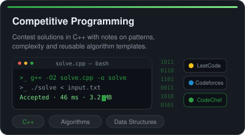
  </a>
  &nbsp;
  <a href="https://github.com/cu-sanjay/DSA-Sheets">
    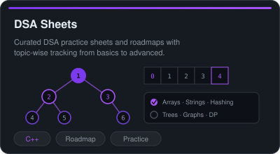
  </a>

  <a href="https://urldefender.vercel.app/">
    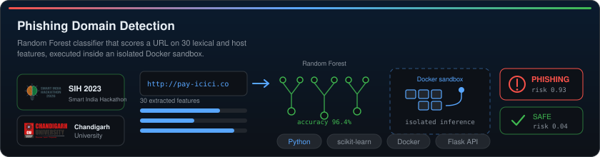
  </a>

 

  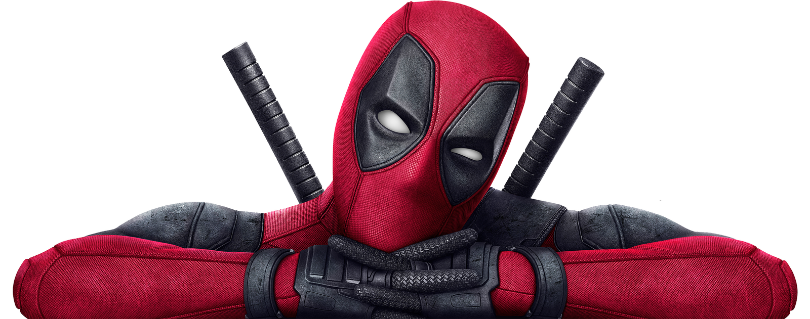

 

  

  

    <i>
      keep building. keep shipping. 
      v0.1 is never the banger. that is fine. 
      you deploy, it breaks, you debug, you fix, you ship it again. 
      that loop is the job. it gets better if you stay in it.
    </i>
  

  

    
      if you are doing dsa, start here:
      <a href="https://github.com/cu-sanjay/Competitive-Programming">competitive programming</a>. 
      need help, a second pair of eyes or someone for freelance work? text me. 
      i am around. for the community.
    
  

  

